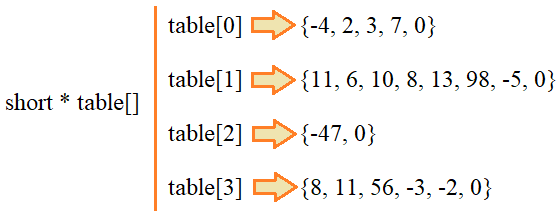

# 6.7 Рекурсивные функции. Задачи

## Task 2 - Подвиг 2

Продолжите программу. Необходимо объявить рекурсивную функцию с именем recursive и одним целочисленным параметром, которая бы выводила в консоль в одну строчку через пробел целые числа в диапазоне от MAX_RECURSION до 1 (включительно).
P. S. В теле функции recursive не использовать какие-либо операторы циклов.

## Task 3 - Подвиг 3

Продолжите программу. Необходимо объявить рекурсивную функцию со следующей сигнатурой:
```size_t range_to_ar(int* ptr_a, size_t max_len, int from, int to, size_t count);```
Эта функция должна последовательно заносить в переданный массив (через указатель ptr_a) целые числа в диапазоне [from; to] (включая границы) с шагом 1, не превышая длину массива max_len. Функция range_to_ar возвращает число count - записанных в массив значений (не более max_len).
В функции main выведите в консоль в одну строчку через пробел первые cnt значений массива ar.
P. S. В теле функции range_to_ar не использовать какие-либо операторы циклов.
Тесты: https://github.com/selfedu-rus/c-tests/tree/main/6.7.3

## Task 4 - Подвиг 4

Продолжите программу. Объявите рекурсивную функцию со следующей сигнатурой:
```int sum_ar(const short* ar, size_t len, size_t indx);```
которая вычисляет сумму значений элементов переданного массива ar и возвращает вычисленное значение.
Вспомогательный параметр indx (с начальным значением 0) служит для перебора элементов массива ar при рекурсивном вызове функции sum_ar.
В функции main вызовите функцию sum_ar и выведите в консоль возвращенной ей значение в виде целого числа.
P. S. В теле функции sum_ar не использовать какие-либо операторы циклов.
Тесты: https://github.com/selfedu-rus/c-tests/tree/main/6.7.4

## Task 5 - Подвиг 5*

Продолжите программу. Необходимо дописать рекурсивную функцию to_flat, которая в одномерный массив v по порядку заносит целые числа из таблицы чисел table. Таблица представляет собой массив указателей на целочисленные массивы:

В конце каждого одномерного массива всегда стоит число 0 - маркер конца данных. Максимальное число записываемых в массив v данных составляет max_len_v (превышать это значение нельзя). На выходе функция to_flat возвращает количество записанных в массив v числовых значений.
Например, для следующих данных:
```short ar_1[] = {1, 2, 3, 0};```
```short ar_2[] = {4, 5, 6, 7, 8, 0};```
```short ar_3[] = {-1, -2, 0};```
```short ar_4[] = {-3, -4, -5, 0};```
```short * table[] = {ar_1, ar_4, ar_3, ar_2};```
Функция to_flat в массив v должна занести числовые значения:
1 2 3 -3 -4 -5 -1 -2 4 5 6 7 8
P. S. Рекурсивная функция to_flat ничего в консоль выводить не должна. Также в теле функции to_flat недопустимо использовать какие-либо операторы циклов.

## Task 6 - Подвиг 6* (на повторение)

Напишите программу, которая читает строку из входного потока (строку целиком до символа переноса строки). Необходимо ее закодировать азбукой Морзе, где каждой букве ставится в соответствие код (в виде фрагмента строки) из точки и тире. После каждой закодированной буквы должен идти пробел (символ окончания кода буквы). После последнего кода пробела быть не должно (в конце строки). 
Коды азбуки Морзе приведены ниже для латинского алфавита (большие и малые буквы кодируются одинаково), цифр и символа пробела:
| A | .-   | J | .--- | S | ...   | 2 | ..--- |
|---|------|---|------|---|-------|---|-------|
| B | -... | K | -.-  | T | -     | 3 | ...-- |
| C | -.-. | L | .-.. | U | ..-   | 4 | ....- |
| D | -..  | M | --   | V | ...-  | 5 | ..... |
| E | .    | N | -.   | W | .--   | 6 | -.... |
| F | ..-. | O | ---  | X | -..-  | 7 | --... |
| G | --.  | P | .--. | Y | -.--  | 8 | ---.. |
| H | .... | Q | --.- | Z | --..  | 9 | ----. |
| I | ..   | R | .-.  | 1 | .---- | 0 | ----- |
Пробел   -...-
Результат кодирования вывести в консоль виде строки.
P. S. Само кодирование лучше реализовать в виде отдельной функции, которой передается формируемая строка, исходная строка и массив азбуки Морзе.
Тесты: https://github.com/selfedu-rus/c-tests/tree/main/6.7.6

## Task 7 - Подвиг 7* (обратный подвигу 6)

Напишите программу, которая читает закодированную строку с помощью азбуки Морзе. Коды разделены между собой пробелом. Необходимо ее раскодировать, используя азбуку Морзе из предыдущего занятия:
| A | .-   | J | .--- | S | ...   | 2 | ..--- |
|---|------|---|------|---|-------|---|-------|
| B | -... | K | -.-  | T | -     | 3 | ...-- |
| C | -.-. | L | .-.. | U | ..-   | 4 | ....- |
| D | -..  | M | --   | V | ...-  | 5 | ..... |
| E | .    | N | -.   | W | .--   | 6 | -.... |
| F | ..-. | O | ---  | X | -..-  | 7 | --... |
| G | --.  | P | .--. | Y | -.--  | 8 | ---.. |
| H | .... | Q | --.- | Z | --..  | 9 | ----. |
| I | ..   | R | .-.  | 1 | .---- | 0 | ----- |
Пробел    -...-
Полученное сообщение (строку) вывести в консоль.
P. S. Декодирование лучше реализовать в виде отдельной функции, которой передается формируемая строка, исходная строка и массив азбуки Морзе.
Тесты: https://github.com/selfedu-rus/c-tests/tree/main/6.7.7