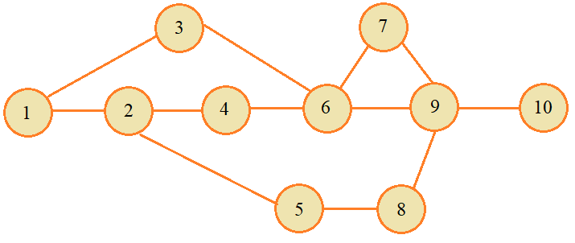

# 7.8 Реализация стека (пример использования структур). Задачи

## Task 2 - Подвиг 2*

Необходимо написать программу, которая в стеке хранит историю посещения пользователем веб-страниц (URL-адреса страниц). Для этого необходимо повторить реализацию стека, приведенного в занятии (или написать свою собственную), со следующим функционалом:
1. Каждый объект стека представляется структурой с идентификатором tag_obj и содержит поля: указатель next на следующий объект; строку url максимальной длиной 1024 символа (адрес посещенной страницы). Объявить еще одно имя типа OBJ для struct tag_obj.
2. На первый элемент стека должен вести указатель top типа OBJ. Если стек пуст, то top равен NULL.
3. Для добавления нового элемента в стек реализовать функцию push со следующей сигнатурой:
```OBJ* push(OBJ* top, const char* url);```
Функция возвращает указатель на новый созданный объект.
4. Для удаления объекта из стека реализовать функцию pop со следующей сигнатурой:
```OBJ* pop(OBJ* top);```

В функции main создайте стек, в который последовательно (в указанном порядке) поместите следующие URL-адреса:
https://proproprogs.ru/c_base/c_etapy-translyacii-programmy-v-mashinnyy-kod-standarty
https://proproprogs.ru/c_base/c_struktura-i-ponimanie-raboty-programmy-hello-world
https://proproprogs.ru/c_base/c_dvoichnaya-shestnadcaterichnaya-i-vosmerichnaya-sistemy-schisleniya
https://proproprogs.ru/c_base/c_lokalnye-i-globalnye-peremennye
https://proproprogs.ru/c_base/c_perechisleniya-enum-direktiva-typedef
P. S. В консоль ничего выводить не нужно. Не забудьте в конце программы освободить память (после макроопределения \__ASSERT_TESTS__), занимаемую элементами стека.

## Task 3 - Подвиг 3 (на повторение, без стека)

Необходимо написать программу, которая бы описывала следующую схему станций метро:

Для этого необходимо объявить следующую структуру:
```enum {name_length=50, total_links=50, max_path_station=100};```
```typedef struct tag_station {```
```    char name[name_length];                 // название станции метро```
```    struct tag_station* links[total_links]; // связи станции метро с другими соседними станциями```
```    short count_links;                      // общее количество связей```
```    char fl_reserved;                       // зарезервированная переменная (полезна при реализации алгоритма поиска маршрута)```
```} STATION;```
После этого объявите вариадическую функцию set_station_links со следующей сигнатурой:
```void set_station_links(STATION* st, int count_links, ...)```
Здесь st - станция метро, для которой формируются связи с другими соседними станциями; count_links - общее число таких связей; вариадические параметры должны представлять собой указатели типа STATION* в количестве count_links, которые заносятся в массив links объекта st. То есть, функция set_station_links связывает объект st с другими, указанными в вариадических параметрах объектами, записывая их адреса в массив links. Также не забудьте задать значение поля count_links в объекте (структуре) st.
Продолжите функцию main, в которой с помощью функции set_station_links сформируйте связи между станциями метро в соответствии с приведенным рисунком.
P. S. В консоль ничего выводить не нужно.

## Task 4 - Подвиг 4* (продолжение, на повторение)

Скопируйте программу, написанную в предыдущем 3-м подвиге. Необходимо добавить функцию поиска кратчайшего маршрута от одной станции до другой. Функция должна иметь следующую сигнатуру:
```void find_path(STATION* from, STATION* to, STATION *path[], int* count_st);```
Здесь from - начальная станция; to - конечная станция; path - массив указателей из станций метро кратчайшего маршрута (включая станции from и to); count_st - указатель на целочисленную переменную, хранящую общее число станций в найденном маршруте. Станции в массиве path должны следовать от начальной from до конечной to, без перескоков через станции, последовательно.
Пример использования функции find_path:
```STATION* path[max_path_station];```
```int count_st = 0;```
```find_path(&st[0], &st[9], path, &count_st);```
```for(int i = 0;i < count_st;++i)```
```    printf("[%s] ", path[i]->name);```
P. S. В консоль ничего выводить не нужно, только добавить функцию find_path и другие вспомогательные функции для поиска кратчайшего маршрута.